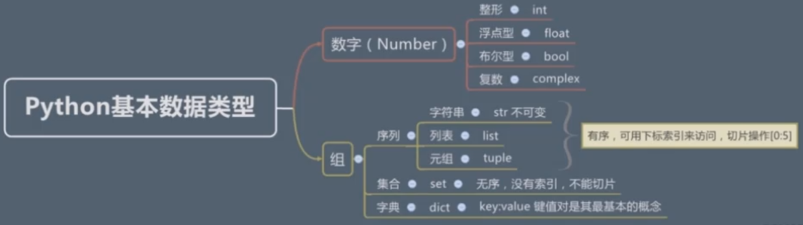

> 基于IDLE（python3.7.2 shell）

# python 基本的数据类型

### print 打印字符串
```python
>>> print('Hello World')
Hello World
```
### type() 检测数据类型
```python
>>> type(1)
<class 'int'>
>>> type(-1)
<class 'int'>
>>> type(1.1)
<class 'float'>
>>> type(1+0.1)
<class 'float'>
>>> type(1+1)
<class 'int'>
>>> type(1+1.0)
<class 'float'>
>>> 1+1.0
2.0
>>> type(1*1)
<class 'int'>
>>> type(1*1.0)
<class 'float'>
>>> type(2/2)
<class 'float'>
>>> 2/2
1.0
>>> type(2//2) // 双斜杠代表整除，只取结果整数部分，并非四舍五入
<class 'int'>
>>> 2//2
1
>>> 3//2
1
>>> 3/2
1.5
```
### 二进制 八进制 十进制 十六进制的表示方式
```python
>>> 0b10 // 二进制 0b 开头
2
>>> 0o11 // 八进制 0o 开头
9
>>> 0x1F // 十六进制 0x 开头
31
>>> 0x1f // 大小写均可表示
31
>>> 0O11 // 八进制 第二个字母大写也可以
9
>>> 0B11 // 二进制第二个字母大写也可以
3
```
### 不同进制间的转换
```python
// 转为二进制 bin()
>>> bin(10) 
'0b1010'
>>> bin(0o7)
'0b111'
>>> bin(0xe)
'0b1110'
// 转为十进制
>>> int(0b11)
3
>>> int(0b111)
7
>>> int(0o77)
63
// 转为十六进制
>>> hex(888)
'0x378'
>>> hex(0o7777)
'0xfff'
// 转为八进制
>>> oct(777)
'0o1411'
```
### 布尔类型 
```python
>>> True
True
>>> False
False
>>> true // True 和False 首字母必须大写，否则报错
Traceback (most recent call last):
  File "<pyshell#49>", line 1, in <module>
    true
NameError: name 'true' is not defined
>>> TRUE // 这样写也报错
Traceback (most recent call last):
  File "<pyshell#50>", line 1, in <module>
    TRUE
NameError: name 'TRUE' is not defined
>>> type(True)
<class 'bool'>
>>> type(False)
<class 'bool'>
>>> int(True) // 转为10进制
1
>>> int(False) // 转为10进制
0
>>> bool(1) // 数字转布尔
True
>>> bool(0) 
False
>>> bool(2)
True
>>> bool(-1.1)
True
>>> bool(0b01)
True
>>> bool(0b0)
False
>>> bool('')
False
>>> bool(' ')
True
>>> bool('abc')
True
>>> bool('')
False
>>> bool([1,2,3])
True
>>> bool([])
False
>>> bool({1,1,1})
True
>>> bool({})
False
>>> bool(None)
False
```
### 复数 `(此处没有细讲)`
```python
>>> 36j
36j
```
### 字符串类型
```python
>>> 'hello world'
'hello world'
>>> "hello word"
'hello word'
>>> '1'
'1'
>>> type(1)
<class 'int'>
>>> type('1')
<class 'str'>
>>> 'let's go'
SyntaxError: invalid syntax
>>> "let's go"
"let's go"
>>> "let's go"
"let's go"
>>> 'let"s go'
'let"s go'
>>> 'let\'s go' //  \ 表示 转义字符
"let's go"
>>> '''hello // 三引号 用以表示多行字符串 单双引号 都可以
world
hello world
hello world
'''
'hello\nworld\nhello world\nhello world\n'
>>> """
hello world
hello world
"""
'\nhello world\nhello world\n'
>>> """hello world\nhello world\nhello world"""
'hello world\nhello world\nhello world'
>>> print("""hello world\nhello world\nhello world""")
hello world
hello world
hello world
>>> """
hello world
hello woorld
"""
'\nhello world\nhello woorld\n'
>>> 'hello\
world'
'helloworld'
>>> print('hello \\n world')
hello \n world
>>> print(r'hello \n world') //字符串前加 r 表示禁止转义
hello \n world
>>> r'hello\nworld' 
'hello\\nworld'
>>> R"C:\Windows" // 大写 R 也可以
'C:\\Windows'
>>> 'hello\nworld'
'hello\nworld'
```
### 字符串运算和取值
```python
>>> "hello"+" world" // 两个字符串表示拼接
'hello world'
>>> "hello "+3 // 和数字类型相加会报类型错误
Traceback (most recent call last):
  File "<pyshell#132>", line 1, in <module>
    "hello "+3
TypeError: can only concatenate str (not "int") to str
>>> "hello"*3 // 字符串 乘以 数字 表示重复字符串
'hellohellohello'
>>> "hello world"*"aaa" // 两个字符串相乘报错
Traceback (most recent call last):
  File "<pyshell#114>", line 1, in <module>
    "hello world"*"aaa"
TypeError: can't multiply sequence by non-int of type 'str'
>>> "hello "* "3" // 和数字字符串相乘也报错
Traceback (most recent call last):
  File "<pyshell#133>", line 1, in <module>
    "hello "* "3"
TypeError: can't multiply sequence by non-int of type 'str'
>>> "hello world"[0] // 按下标取值 从 0 开始 0 即表示第一个字符串
'h'
>>> "hello world"[3]
'l'
>>> "hello world"[-1] // 负数表示从后面开始数，-1表示倒数一个字符串
'd'
>>> "hello world"[0:4] // [int:int]表示截取字符串  这行代码表示从第0个开始截取到下标为4的前一位
'hell'
>>> "hello world"[1:4]
'ell'
>>> "hello world"[0:-1] // 截取到最后一个的前一位
'hello worl'
>>> "hello world"[0:-0]
''
>>> "hello world"[0:20] // 超出范围截取到最后一位
'hello world'
>>> "hello world"[6:] // 第二个数字不写表示截取到最后
'world'
>>> "hello python java c# javascript php ruby"[6:]
'python java c# javascript php ruby'
>>> "hello python java c# javascript php ruby"[:-4] // 前面不写表示从0位开始
'hello python java c# javascript php '
>>> "hello python java c# javascript php ruby"[-4:]
'ruby'
```
