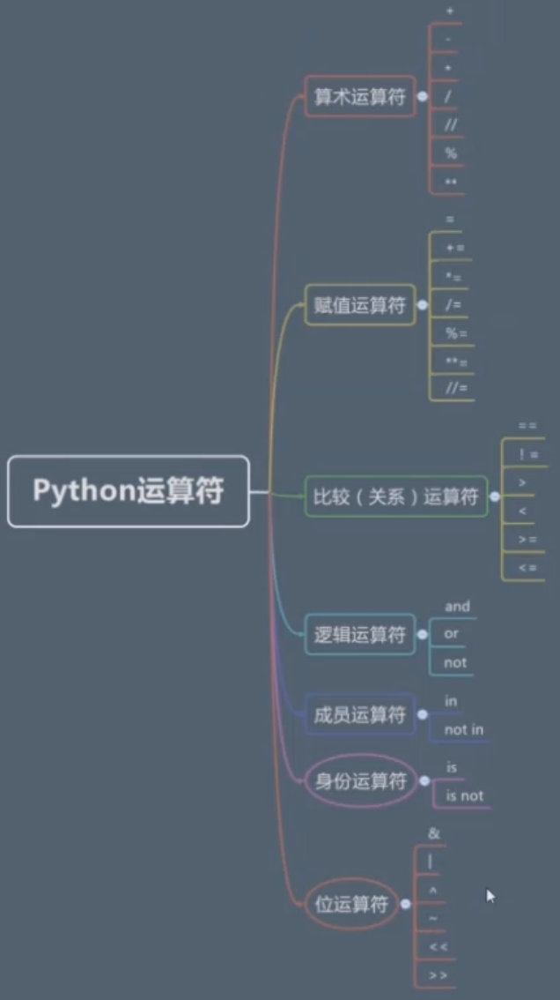

# 变量与运算符

> 列表A为[1,2,3,4,5,6] 列表B为 [1,2,3]
>
> 列表 A 和 列表 B   A乘以3  加上B  再加上列表A
> 
> A*3+B+A
```python
>>> [1,2,3,4,5,6]*3+[1,2,3]+[1,2,3,4,5,6]
[1, 2, 3, 4, 5, 6, 1, 2, 3, 4, 5, 6, 1, 2, 3, 4, 5, 6, 1, 2, 3, 1, 2, 3, 4, 5, 6]
```
### 变量

> 定义一个变量
>
> = 赋值符号
```
>>> A = [1,2,3,4,5,6]
>>> print(A)
[1, 2, 3, 4, 5, 6]
>>

>>> B = [1,2,3]
>>> A*3+B+A
[1, 2, 3, 4, 5, 6, 1, 2, 3, 4, 5, 6, 1, 2, 3, 4, 5, 6, 1, 2, 3, 1, 2, 3, 4, 5, 6]
>>> skill = ['新月打击','苍白之瀑']
```
> 变量名要有意义, 命名可读性要强
>
> 例如 三叶草 three_leaf_grass clover 用clove更专业
>
> 特别不推荐拼音 sanyecao

> 变量的命名规则 : 字母/数字/下划线 首字母不可为数字 变量名区分大小写
>
> 可以是 abc  _abc 不可以是 2a &a  $a *a 等
>
> 系统保留关键字,不能用在变量名中
>
> 比如  and  if import
>
>变量是弱类型

```python
>>> type = 3
>>> print(type)
3
```
> **type 虽然不是保留关键字,可以用,但是不建议使用,极易引起错误**
```python
>>> type = 1
>>> type(1)  //type 被赋值为 int 类型 1  ,不再是原来的函数功能,所以使用会报错
Traceback (most recent call last):
  File "<pyshell#47>", line 1, in <module>
    type(1)
TypeError: 'int' object is not callable
>>> 1(1) // 上面的 type(1) 相当于 1(1) 出现的错误是一样的
Traceback (most recent call last):
  File "<pyshell#48>", line 1, in <module>
    1(1)
TypeError: 'int' object is not callable
```
> int 是值类型 list 是引用类型
>
> int str tuple (不可改变) 值类型 list set dict (可变)引用类型
```python
>>> a = 'hello'
>>> a = a + 'python'
>>> print(a)
hellopython
>>> b = 'hello'
>>> id(b) # id() 查看变量在内存的地址
49865152
>>> b = b+'python'
>>> id(b)
49862760
# 字符串被修改后内存地址变更,原地址字符串并没有被改变
>>> a = [1,2,3]
>>> id(a)
52318616
>>> hex(id(a))
'0x31e5198'
# 内存地址一般都是十六进制的
>>> a[0] = '1'
>>> id(a)
52318616
>>> a = (1,2,3) # tuple 是不可变类型
>>> a[0] = '1' # 修改元素会报错
Traceback (most recent call last):
  File "<pyshell#69>", line 1, in <module>
    a[0] = '1'
TypeError: 'tuple' object does not support item assignment

>>> b = [1,2,3]
>>> b.append(4) # 追加元素 list是可变元素,因此可以追加元素
>>> print(b)
[1, 2, 3, 4]
>>> c = (1,2,3)
>>> c.append(4) # tuple是不可变元素,追加元素会报错
Traceback (most recent call last):
  File "<pyshell#75>", line 1, in <module>
    c.append(4)
AttributeError: 'tuple' object has no attribute 'append'

>>> a = (1,2,3,[1,2,4])
>>> a[2]
3
>>> a[3]
[1, 2, 4]
>>> a[3][2] 
4
>>> a = (1,2,3,[1,2,['a','b','c']])
>>> a[3][2][1]
'b'
>>> a = (1,2,3,[1,2,4])
>>> a[3][2] = 'a' # 元组中的元素是可变元素的,可以改变
>>> print(a)
(1, 2, 3, [1, 2, 'a'])
```
###  运算符

```python
>>> 'hello'+'world'
'helloworld'
>>> [1,2,3]*3
[1, 2, 3, 1, 2, 3, 1, 2, 3]
>>> 3-1
2
>>> 3/2
1.5
>>> 3//2
1
>>> 5%2 # 余数
1
>>> 2**2 # 2的2次方
4
>>> 2**5 # 2的5次方
32
```
### 算术运算符

#### 赋值运算符
```python
>>> c = 1
>>> c = c+1
>>> print(c)
2
>>> c+=1 # 等同于 c = c+1
>>> print(c)
3
>>> c++ # python 不支持自增自减操作
SyntaxError: invalid syntax
>>> c-- # python 不支持自增自减操作
SyntaxError: invalid syntax
>>> b=2
>>> a=3
>>> b=b+a
>>> b+=a
>>> print(b)
8
>>> b-=a # 等同于 b = b-a
>>> print(b)
5
>>> b = b-a
>>> b*=a # 等同于 b = b*a
>>> print(b)
6
# /= %=
```

#### 比较(关系)运算符
> 返回布尔值
```python
>>> 1==1
True
>>> 1>1
False
>>> 1>=1 # 大于或者等于
True
>>> a=1
>>> b=2
>>> a!=b # 不等于
True
>>> b = 1
>>> b+=b>=1
>>> print(b)
2
>>> print(b>=1)
True
>>> int(True)
1
>>> b=b+1
>>> 1>1
False
>>> 2>3
False
>>> 'a'>'b' # 字符串比较的是 ascii
False
>>> ord('a')
97
>>> ord('b')
98
>>> 'abc'<'abd' # 先比较a再比较b再比较c
True
>>> ord('c')
99
>>> ord('d')
100
>>> [1,2,3]<[2,3,4] # 依次比较
True
>>> (1,2,3)<(1,3,2) # tuple 是无序的,因此不按顺序比较
True
# 还有很多,不再一一讲解,有疑问多自己动手实践
```
#### 逻辑运算符
> 操作的是布尔类型的,返回的也是布尔类型
>
> and(与): 并且的意思  or(或) : 或者 not(非) : 不是...
```python
>>> True and True
True
>>> True and False
False
>>> True or True
True
>>> True or False
True
>>> False or True
True
>>> False or False
False
>>> not True
False
>>> not not True
True
>>> not False
True
>>> 1 and 1
1
>>> 'a' and 'b'
'b'
>>> 'a' or 'b'
'a'
>>> not 'a'
False
>>> 'a' and ''
''
# int float 0 被认为是False 非0 表示 True
>>> not 0.1
False
# 字符串 空字符串 False, 否则为True
>>> not '0'
False
>>> bool('0')
True
# [] 空的列表 False, True
>>> not []
True
>>> not [1,2]
False
# tuple set dict 和 list相同
>>> not 1
False
>>> [1] or []
[1]
>>> [] or [1]
[1]
>>> 'a' and 'b'
'b'
>>> '' and 'b'
''
>>> 1 and 0
0
>>> 0 and 1
0
>>> 1 and 2
2
>>> 2 and 1
1
>>> 0 or 1
1
>>> 1 or 0
1
>>> 0 or ''
''
>>> '' or 0
0
>>> 1 or 2
1
>>> 2 or 1
2
```
#### 成员运算符
> in     not in
```python
>>> a = 1
>>> a in [1,2,3] # a 是否在 列表中
True
>>> b = 5
>>> b in [1,2,3] # b 是否在 列表中
False
>>> b not in [1,2,3] # b 是否不在列表中
True
>>> b not in (1,2,3) # b 是否不再 tuple中
True
>>> b not in {1,2,3} # b 是否不再 set 中
True
>>> b = 'a'
>>> b in {'c':1} # b 是否在 dict 中
False
>>> b = 1
>>> b in {'c':1}
False
>>> b = 'c' 
>>> b in {'c':1} # dict 是判断key是否存在
True
```
#### 身份运算符
> `is`  `is not`
>
> 与对象有关,现在先了解一下, 后面讲对象时还会讲
>
> 关系运算符(==) 比较的是值 , is比较的是内存地址

```python
>>> a = 1
>>> b = 2
>>> a is b
False
>>> a =1
>>> b=1
>>> a is b # 如果两个变量取值相等 则 is  返回 True
True
>>> b is a
True
>>> a = 'hello'
>>> b = 'world'
>>> a is b
False
>>> c = 'hello'
>>> a is c
True
>>> a= 1
>>> b=1.0
>>> a == b
True
>>> a is b
False

>>> a='hello'
>>> b = 'hell'
>>> id(a)
53084448
>>> id(b)
53084352
>>> b+='o'
>>> print(b)
hello
>>> id(b)
52981632
>>> a is b # 赋值时不一样,通过改变 改为相同的值, 地址也不一样,因此 a is b为 False
False
>>> print(a)
hello
>>> print(b)
hello
>>> a is b
False
>>> a == b
True
>>> a = {1,2,3}
>>> b = {2,1,3}
>>> a == b
True
>>> a is b
False
>>> c = (1,2,3)
>>> d = (2,1,3)
>>> c == d
False
>>> c is d
False
# {} 集合是无序的所以  a == b
# () 元组是有序的, 会按顺序比较 所以 不相等
>>> a = 1
>>> b = 2
>>> a == b
False
>>> a is b
False
>>> a == b
False
```
#### 类型 type 判断 `isinstance()`
> 一切都是对象
>
> 对象的三个特征  id  value type
>
> id 用 is 判断  value 用 == 判断  type 用 isinstance 判断
```python
>>> type(a) == int
True
>>> a = 'hello'
>>> type(a) == int
False
>>> type(a) == str
True
>>> isinstance(a,str)
True
>>> isinstance(a,int)
False
>>> isinstance(a,(int,str,float)) # 是否是元组中的任意一种
True
>>> isinstance(a,(int,float))
False
```
#### 位运算符 
> 把数字当做二进制数进行运算
``` python
>>> a = 2
>>> b = 3
>>> a & b
2
>>> b & a
2
>>> 10
10
>>> 按位或 |
SyntaxError: invalid syntax
>>> a= 2
>>> b=3
>>> a | b
3
```